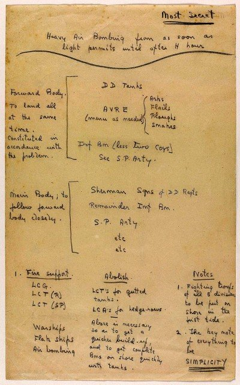

# its350
course materials and references for its350

## Lab03: One-time pad cipher

__Description__

Get familiar with the source code for One-time pad cipher, complete the following tasks:

* Use Linux commands and Python to read and write text files in binary mode
* Use Linux commands and Python to demonstrate encryption and decryption on text file [GeneralMontgomerysDDaySpeech.txt](./data/GeneralMontgomerysDDaySpeech.txt) with One-time pad cipher in both module addition and bit xor algorithms.
* Use Linux commands and Python to demonstrate encryption and decryption on _ONLY the DATA_ of image file !

 

with One-time pad cipher in both module addition and bit xor algorithms.


*Image processing*

```bash
# convert image from any format into 24bit BMP image
convert image.any -type truecolor image.bmp

# 24bit BMP image dissection
# extract head
head -c 54 image.bmp > header
# extract data
tail -c +55 image.bmp > data
# concatenate head and data
cat header data > new.bmp
```

__Report__

Write a report about the process you complete the tasks in the description, key screen snapshots are needed as evidences.

_Review questions:_

* How to generate the key truly randomly in one-time pad cipher?
* How to make sure the one-time pad key is used only once?
* Suppose sender and receiver locate way from each other, how could they share the key securely before their confidential communication (encrypt the communication with one-time pad cipher after they share the same secret key)?


__References__
* [General Montgomery’s One Page Battle Plan for D-Day Released](https://www.warhistoryonline.com/war-articles/battle-plans-d-day-released.html)
* [BMP file format](https://en.wikipedia.org/wiki/BMP\_file\_format)
* [How to convert an image to a 24-bit BMP in commandline?](https://unix.stackexchange.com/questions/394003/how-to-convert-an-image-to-a-24-bit-bmp-in-commandline)
* _Generating random data in Python_
  * [Python OS module](https://docs.python.org/3/library/os.html)
    * [Python | os.urandom() method](https://www.geeksforgeeks.org/python-os-urandom-method/)
  * [Generating Random Data in Python](https://realpython.com/python-random/)
    * [random — Generate pseudo-random numbers](https://docs.python.org/3/library/random.html)
    * [secrets — Generate secure random numbers for managing secrets](https://docs.python.org/3/library/secrets.html)
* _Handling binary string in Python_
  * [Working with Binary Data in Python](https://www.devdungeon.com/content/working-binary-data-python)
  * [Unicode and Binary Data](https://learning-python.com/strings30.html)
  * [Convert binary string representation of a byte to actual binary value in Python](https://stackoverflow.com/questions/7213996/convert-binary-string-representation-of-a-byte-to-actual-binary-value-in-python)
  * [binascii — Convert between binary and ASCII](https://docs.python.org/3/library/binascii.html)
* [SEED Pseudo Random Number Generation Lab](https://seedsecuritylabs.org/Labs\_16.04/Crypto/Crypto\_Random\_Number/)
* [SEED Crypto Lab -- Secret-Key Encryption](https://seedsecuritylabs.org/Labs\_16.04/Crypto/Crypto\_Encryption/)


