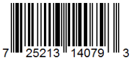
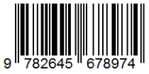
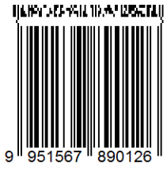

# its350
course materials and references for its350

## Lab06: Data Integrity

__Description__

1. _Task 1(20%)_

Five data blocks labeled as <!-- $ d_1, d_2, d_3, d_4, d_p  $ -->  ( <!-- $ d_p $ -->  is the parity block) are stored on a RAID-5 storage system consisting of 5 disks. It is known that: <!-- $ d_1 = 1101000111000111, d_2 = 1001001101111010, d_4 = 0001000010100000, d_p = 0000011100100001 $ --> . Show your process to recover <!-- $ d_3 $ --> . Here the block size is just for illustration. On real system, the block size may be 4096 bytes, 8192 bytes, etc.

2. _Task 2(20%, each checksum of the first two 6%, the last one 8%)_

For special messages such as bank account number, ISBN-13, EAN-13, etc. Each of them contains check digits for error detection.

Verify the validity of the following special messages:

  * UPC-A: 
  * ISBN-13: 
  * EAN-13: 

Show your calculation.

3. _Task 3(60%)_

	1. (20%, each of the first five hash codes 3%, the last hash code 5%) Create an empty file and a file with exactly one blank space then  find the following hash codes for these two files. Create a table to compare the below hash codes between the two files.

		* MD5
		* SHA1
		* SHA224
		* SHA256
		* SHA384
		* SHA512

	2. (20%, each of the first five hash codes 3%, the last hash code 5%) Download a JPEG image from Internet. Let us name it as origin.jpg. Then use the hex editor Bless to modify only one bit in the image file to get a new file and name it as modify.jpg. Create a table to compare the hash codes between the original file and the modified file to verify the avalanche property of the cryptographic hash functions below.

    * MD5
    * SHA1
    * SHA224
    * SHA256
    * SHA384
    * SHA512

	3. (20%, each hash code 10%) Download the lastest [gpg4win](https://www.gpg4win.org/) from its [official website](https://www.gpg4win.org/) then check its integrity against its given hash code.

__Report__

Write a report about the process you complete the tasks in the description, key screen snapshots are needed as evidences.

__Demo video__

* [Data Integrity](https://youtu.be/L7TpOqTlg9s)

__References__
* [Gpg4win](https://www.gpg4win.org/)