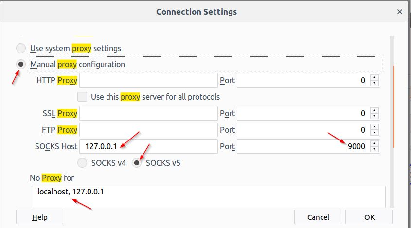

# its350
course materials and references for its350

## Lab12: Firewall Exploration

### Description
**This lab is adapted from [SEED Linux Firewall Exploration Lab](https://seedsecuritylabs.org/Labs\_16.04/Networking/Firewall/)**

- [x] Task 1: Using Firewall
- [x] Task 3: Evading Egress Filtering
  - [x] Task 3.a:  Telnet to Machine B through the firewall
  - [x] Task  3.b:  Connect to Facebook using SSH Tunnel.
- [x] Task 4: Evading Ingress Filtering

In this lab, we will learn

* how to use the firewall [Netfilter](https://en.wikipedia.org/wiki/Netfilter) in Linux through its command line interface [ufw](http://manpages.ubuntu.com/manpages/xenial/en/man8/ufw.8.html)? [Netfilter](https://en.wikipedia.org/wiki/Netfilter) also has a GUI [gufw](http://gufw.org/).
* how to evade firewall ingress filtering and egress filtering?

 

**Two VMs are needed, three VMs are better:**

* use
```bash
ifconfig -a
```
to find the IP settings for each VM, make sure all VMs can communicate (ping) with each other and access the Internet
* make a file whose file name can identify the VM at home folder, e.g. <!-- $ V\!M_1:I\!P_1,V\!M_2:I\!P_2,V\!M_3:I\!P_3 $ --> , replace these IPs with your real IP addresses through out this lab
* *Disable IPv6 in the NAT network*

### Task 1 (40%): Using Firewall

1. Step 1(4%): *Get familiar with ufw:* Find its user manual from command line using 
```bash
man ufw
```
press key 'SPACE' to scroll down, 'q' to quit.

2. Step 2(6%, each command 2%): *Set the default rules and enable ufw on all VMs:* run the commands on each VM.

  * Setup the default policy to *allow*: 
  
  :sparkles: sudo ufw default allow
  * Enable the firewall: 
  
  :sparkles: sudo ufw enable
  * Check the firewall status: 
  
  :sparkles: sudo ufw status verbose. 
  **Run this command to verify your operation result every time when you add/modify/delete firewall rules.**

3. Step 3(15%): Block egress and ingress of telnet on <!-- $ V\!M_1 $ --> :  Set the firewall rules then try telnet. *Every time you telneted into another VM, run command 'ls' to check you are in the other VM now, after that, type 'exit' to return to your original VM.*

  * (3%)Check you can telnet from <!-- $ V\!M_1 $ -->  to <!-- $ V\!M_2 $ --> , run the command on <!-- $ V\!M_1 $ --> :  
  :sparkles: telnet <!-- $ I\!P_2 $ --> 
  * (3%)Check you can telnet from <!-- $ V\!M_2 $ -->  to <!-- $ V\!M_1 $ --> , run the command on <!-- $ V\!M_2 $ --> :  
  :sparkles: telnet <!-- $ I\!P_1 $ --> 
  * (3%)Prevent <!-- $ V\!M_1 $ -->  from doing telnet to <!-- $ V\!M_2 $ --> (Block egress, from the perspective of <!-- $ V\!M_1 $ --> , run the commands on <!-- $ V\!M_1 $ --> ):  
  :sparkles: sudo ufw deny out to <!-- $ I\!P_2 $ -->   port 23  
  :sparkles: telnet <!-- $ I\!P_2 $ -->   will fail
  * (6%)Prevent <!-- $ V\!M_2 $ -->  from doing telnet to Machine <!-- $ V\!M_1 $ --> (Block ingress, again from the perspective of <!-- $ V\!M_1 $ --> , set the firewall rule on <!-- $ V\!M_1 $ --> ):  
  :sparkles: sudo ufw deny in from <!-- $ I\!P_2 $ -->   to <!-- $ I\!P_1 $ -->  port 23 

  then from <!-- $ V\!M_2 $ --> , try telnet to <!-- $ V\!M_1 $ --> , run the command in <!-- $ V\!M_2 $ --> 
  
  :sparkles: telnet <!-- $ I\!P_1 $ -->   
  
  will fail

4. Step 4(15%): Prevent <!-- $ V\!M_1 $ -->  from visiting an external web site E: a website may have several IP addresses, they should be all blocked. The IP addresses of domain name E can be found using command [dig E](https://superuser.com/questions/152576/how-to-get-all-ips-of-a-domain), for example,  
:sparkles: dig www.facebook.com  
:sparkles: dig facebook.com

**Note: the ip addresses of Facebook change dynamically, so replace it with syr.edu in this lab**


* (2%)Check you can access the external web site E using Firefox
* (4%)Find the IP addresses of the external web site E using  
:sparkles: dig www.syr.edu  
:sparkles: dig syr.edu

* (9%)Prevent <!-- $ V\!M_1 $ -->  from visiting an external web site E:  
:sparkles: sudo ufw deny out to <!-- $ I\!P_E $ -->  port 80   
:sparkles: sudo ufw deny out to <!-- $ I\!P_E $ -->  port 443
* Check you can NOT access the external web site E using Firefox now. *To become effective: close tabs of website E, clear Firefox cached data, then restart Firefox*
 
### Task 2 (30%, each step 6%): Evading Egress Filtering
Now <!-- $ V\!M_1 $ -->  seems like a work computer which blocks surfing website E. If you can login your home computer, say <!-- $ V\!M_2 $ --> , remotely via ssh(like the secure version of telnet) from <!-- $ V\!M_1 $ --> , then you can setup a  ssh tunnel to evade the egress blockage ruled by your company firewall.  *Every time you set a ssh tunnel into another VM, run command 'ls' to check you are in the other VM now, after that, leave the terminal open to keep the ssh tunnel alive.* If you want to close the tunnel, just type 'exit' in the remote terminal, you will come back to your local terminal. 


Work on <!-- $ V\!M_1 $ --> , 

* Step 1: setup a ssh tunnel from <!-- $ V\!M_1 $ -->  to <!-- $ V\!M_2 $ -->  with dynamic port forwarding: run the command on <!-- $ V\!M_1 $ --> 

:sparkles: ssh  -D  9000  -C  seed@<!-- $ I\!P_2 $ --> 
* Step 2: setup proxy: Set the proxy for Firefox in <!-- $ V\!M_1 $ -->  as the figure 'Proxy setup in Firefox using ssh tunnel':


* Step 3: surf website E via the tunnel: Now browse website website E, can you surf it?
* Step 4: break the tunnel: Close the tunnel, try browsing website website E again, can you surf it? 
* Step 5: reconnect the tunnel: Setup the tunnel again, try browsing website website E again, can you surf it?

For further instructions and help refer to the SEED lab manual and the ufw manual.

### Task 3 (30%): Evading Ingress Filtering
Now suppose in your company, there is a secret website which can only be accessed through your work computer <!-- $ V\!M_1 $ --> . Meanwhile, the company firewall blocks any ssh ingress to work machines and any http/https ingress to the secret server from outside. But you can remotely login your home machine <!-- $ V\!M_2 $ -->  via ssh from your work computer <!-- $ V\!M_1 $ --> .

Then you can evade the ingress blockage  through ssh tunnel using *reverse port forwarding*.

*Reverse port forwarding* is also called *remote port forwarding* in many literatures. For further information, please refer to [SSH Tunnel - Local and Remote Port Forwarding Explained With Examples](https://blog.trackets.com/2014/05/17/ssh-tunnel-local-and-remote-port-forwarding-explained-with-examples.html). Reverse port forwarding is a type of static forwarding so *no proxy configuration* is needed.

* Step 0(4%): On <!-- $ V\!M_1 $ --> , setup a secret webpage. Run the following command to modify the default home page of localhost.

```bash
# 1. open index.html in subl
sudo subl /var/www/html/index.html
# 2. In index.html, find the sentence "Apache2 Ubuntu Default Page" then change it to "Apache2 Ubuntu VM1"
```

* *Step 1:(6%)* Setup firewall rules blocking ingress ssh and http/https on <!-- $ V\!M_1 $ --> }.

:sparkles:  sudo ufw deny in from <!-- $ I\!P_2 $ -->   to <!-- $ I\!P_1 $ -->  port 22

:sparkles:  sudo ufw deny in from <!-- $ I\!P_2 $ -->   to <!-- $ I\!P_1 $ -->  port 80

:sparkles:  sudo ufw deny in from <!-- $ I\!P_2 $ -->   to <!-- $ I\!P_1 $ -->  port 443
* *Step 2:(4%)* Reset the proxy of Firefox to 'No proxy' on <!-- $ V\!M_1 $ --> 
* *Step 3:(4%)* Surf the secret website on your work machine <!-- $ V\!M_1 $ --> . Open Firefox, browse '  http://localhost', you should see a webpage says Apache worked.
* *Step 4:(4%)* Setup a reverse tunnel from the work computer <!-- $ V\!M_1 $ -->  to the home <!-- $ V\!M_2 $ --> : 

:sparkles: ssh  -R  9000:<!-- $ I\!P_1 $ --> :80  seed@<!-- $ I\!P_2 $ -->  

This command is run on the work computer <!-- $ V\!M_1 $ --> .
* *Step 5:(4%)* Surf the secret website from home: On the home computer  <!-- $ V\!M_2 $ --> , use Firefox browse   http://localhost:9000, the  secret web page in the company should show up.
* *Step 6:(4%)* Manipulate the tunnel:
	Break the tunnel from <!-- $ V\!M_1 $ --> , then in <!-- $ V\!M_2 $ --> , refresh   http://localhost:9000 in Firefox, what do you observe?
	Reconnect the tunnel from <!-- $ V\!M_1 $ --> , then in <!-- $ V\!M_2 $ --> , refresh   http://localhost:9000 in Firefox, what do you observe?

For further instructions and help refer to the SEED lab manual and the ufw manual.

### Report

Write a report about the process you complete the tasks in the description, key screen snapshots are needed as evidences.


### References
* [SEED Linux Firewall Exploration Lab](https://seedsecuritylabs.org/Labs\_16.04/Networking/Firewall/)
* [Netfilter](https://en.wikipedia.org/wiki/Netfilter)
* [ufw](http://manpages.ubuntu.com/manpages/xenial/en/man8/ufw.8.html)
* [gufw](http://gufw.org/)
* [SSH Tunnel - Local and Remote Port Forwarding Explained With Examples](https://blog.trackets.com/2014/05/17/ssh-tunnel-local-and-remote-port-forwarding-explained-with-examples.html)
* [SSH Port Forwarding Example](https://www.ssh.com/ssh/tunneling/example)
* [SSH/OpenSSH/PortForwarding](https://help.ubuntu.com/community/SSH/OpenSSH/PortForwarding)
* [A Guide to SSH Port Forwarding/Tunnelling](https://www.booleanworld.com/guide-ssh-port-forwarding-tunnelling/)