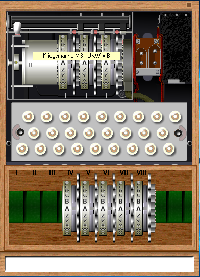
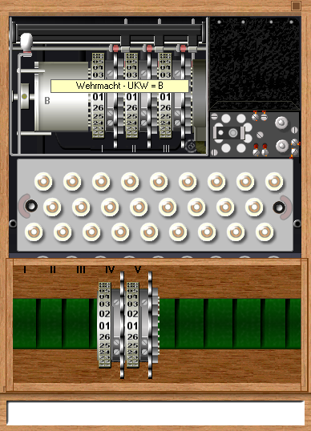

# its350
course materials and references for its350

## Proj: Inside-out Enigma machine

### Description
In this project, firstly practice message encryption/decryption on an [Enigma machine simulator](http://users.telenet.be/d.rijmenants/en/enigmasim.htm), secondly create a [paper Enigma machine](http://wiki.franklinheath.co.uk/index.php/Enigma/Paper_Enigma) to encrypt messages then decrypt the ciphertexts on the simulator Enigma machine, lastly, encrypt messages on the simulator Enigma machine then decrypt the ciphertexts on the paper Enigma machine.

The simulation Enigma machine can exactly simulate the 3-rotor Wehrmacht (Heer and Luftwaffe) Enigma, the 3-rotor Kriegsmarine M3, also called Funkschlussel M, and the famous 4-rotor Kriegmarine M4 Enigma cipher machine, used during World War II from 1939 until 1945. The paper Enigma machine is completely compatible with all settings of a real Enigma machine (models I, M1, M2 and M3).

### Task 1 (40%): Using Enigma machine simulator
1. Download the [Enigma machine simulator](http://users.telenet.be/d.rijmenants/en/enigmasim.htm) and the [Enigma codebook tool](http://users.telenet.be/d.rijmenants/en/codebook.htm), install them on a Windows machine.
2. Follow this video [How to Use Enigma](https://youtu.be/RxUWKiVncMg) to quickly get familiar with the Enigma machine.
3. In the Enigma machine, choose one of the following model, *no ring settings or plugboard settings at the beginning*:

 

4. Complete the encryption/decryption practices described in the [paper Enigma machine](http://wiki.franklinheath.co.uk/index.php/Enigma/Paper_Enigma). *Each practice is a continuation of its previous one*:
   1. With message key "A B C" to decrypt "A E F A E  J X X B N  X Y J T Y". The plaintext is one correct English word.
   2. With message key "A B R" to decrypt "M A B E K  G Z X S G". The plaintext are two correct English words, and your rotors should finish at positions A C B.
   3. With message key "A D S" to decipher "R Z F O G  F Y H P L". The plaintext are  two correct English words, and your rotors finish at positions B F C.
   4. With ring settings at 10, 14 and 21 and message key "X Y Z" to decipher "Q K T P E  B Z I U K", as before, the plaintext are two correct English words.
   5.  With plug board settings for these 10 pairs: "AP BR CM FZ GJ IL NT OV QS WX", ring settings as the previous practice, and message key "V Q Q" to decipher "H A B H V  H L Y D F  N A D Z Y". The plaintext are four English words and your rotors should finish at positions V R F.

### Task 2 (40%): Building a paper Enigma machine
Follow the [paper Enigma machine](http://wiki.franklinheath.co.uk/index.php/Enigma/Paper_Enigma) to build yours, then complete the following practices. *Each practice is a continuation of its previous one, take a video when you are doing the practices.*
*Again, no ring settings or plugboard settings at the beginning.*
1. Complete the encryption/decryption practices described in the [paper Enigma machine](http://wiki.franklinheath.co.uk/index.php/Enigma/Paper_Enigma). You should get the same results as Task 1.
2. With ring settings at 17, 7 and 19, plug board settings for these 4 pairs: "BX CF DG EV",  and message key "F B I" to decipher "UIBUT MIS KUYD", the plaintext is a blessing sentence with three correct English words.
3. Verify your result in the previous practice with the Enigma machine simulator.

### (20%): Report

Write a report about the process you complete the tasks in the description, key screen snapshots are needed as evidences.
*Upload the video recorded in Task 2 to your One Drive, or Google Drive, or DropBox, then share a link with our TA (the TA must be granted to access your video), put the link in the report.*

### References
* [Enigma machine](https://en.wikipedia.org/wiki/Enigma_machine)
* _Enigma Simulator_
  * [Enigma applet](http://russells.freeshell.org/enigma/)
  * [Python Enigma](https://gist.github.com/williame/94beef4b9afea659864950c29d402b90)
  * [Online Enigma](https://www.101computing.net/enigma-machine-emulator/)
  * [Enigma simulator](http://users.telenet.be/d.rijmenants/en/enigmasim.htm)
  * [Enigma App](https://play.google.com/store/apps/details?id=uk.co.franklinheath.enigmasim&hl=en_US&gl=US)
  * [Cryptii](https://cryptii.com/pipes/enigma-machine)
  * [Enigma online](https://observablehq.com/@tmcw/enigma-machine)
* _Paper Enigma_
  * [Paper Enigma](http://wiki.franklinheath.co.uk/index.php/Enigma/Paper_Enigma)
  * [Another one](https://github.com/themaddoctor/BritishNationalCipherChallenge/blob/master/2005/8B/Pringleupdate.pdf)